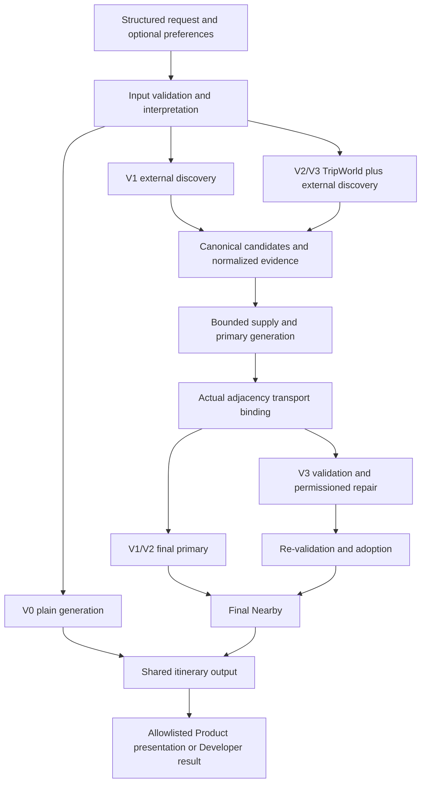

# System architecture and version boundaries

Status: Implemented architecture, consolidated 2026-10-03 against code and PROJECT.md.
This document defines the shared shape; [PROJECT.md](../PROJECT.md) owns current work
status and authorization. Historical checkpoints are not current configuration.

## Responsibility boundaries

The system is a modular monolith: React owns interaction and rendering, FastAPI owns
HTTP/application boundaries, and backend services own LLM calls, retrieval, external
evidence, validation and repair. PostgreSQL with pgvector stores the TripWorld retrieval
corpus. Provider-specific payloads are normalized by integration adapters before domain
policies consume them. LangGraph expresses version orchestration rather than embedding
vendor HTTP calls throughout graph nodes.

| Layer | Owner and responsibility |
| --- | --- |
| User interaction | frontend/src: shared input, Product and Developer pages, streamed progress, presentation |
| API | backend/app/api: Product/Developer/input-assistance endpoints, validation and streaming |
| Application services | backend/app/services: request lifecycle, evidence acquisition and Product projection |
| Orchestration | backend/app/versions: separate V0-V3 graph/config/runner paths |
| Domain | schemas and policies: source-linked requirements, normalized evidence, itinerary and acceptance |
| External boundaries | integrations and tripworld: model/provider clients, persistence and retrieval |
| Independent evaluation | backend/evaluation: submitted-artifact evaluation, outside planner execution |

## Version mechanisms

| Version | Mechanism | Independent command |
| --- | --- | --- |
| V0 | Shared input interpretation, plain LLM itinerary; estimated transport and optional model-knowledge references | scripts/run_v0.py |
| V1 | External place/weather/route/official evidence, shared supply and final Nearby | scripts/run_v1.py |
| V2 | V1 plus TripWorld retrieval, Google identity resolution and canonical merge | scripts/run_v2.py |
| V3 | V2 plus structured validation, authorized targeted repair and re-validation | scripts/run_v3.py |

Product uses **V3**, verified in [PlanningService](../backend/app/services/planning.py).
Developer mode exposes all four. V0 remains free of external travel acquisition;
its ordinary LLM calls do not make it a tool-based planner. V1/V2 do not invoke V3
repair. Shared correctness fixes apply to dependent versions without disguising
them as a later version's exclusive mechanism. A milestone and a user-approved freeze
are distinct; old freezes do not automatically cover later shared changes.

## Request flow

Requirements retain form/text provenance. Discovery opportunity, candidate admission,
scheduled fulfillment and factual feasibility are separate facts. The application owns
identities, budgets, authorization and adoption; models propose interpretations,
classifications, itineraries or patches within their supplied contracts.

## Model identity references

When a model must return an identity supplied by the application, expose a short,
request-local reference such as `p01`, `a01`, `t01`, `s01` or `r01`. Preserve the full
canonical ID in application state, external API calls, persisted artifacts and returned
domain objects. References are deterministic ordinal aliases over complete IDs, never
truncated ID prefixes, ranks or response positions. Separate calls own separate maps.

The provider adapters map declared structured identity fields and identity-keyed tables,
including Repair activity lineage and compact route endpoints. They do not rewrite
user prose, source quotations, names or URLs. Output schemas constrain linked fields to
the supplied references with their original nullability; exact decoding rejects unknown
references before domain validation. Existing candidate ownership, patch permissions,
source alignment and adoption checks remain authoritative after IDs are restored.
Primary-generation and Repair input accounting includes the transmitted aliases,
reference instruction and constrained schema under the existing ceilings.

| Boundary | Identity transport |
| --- | --- |
| V1-V3 primary generation | Place references shared across evidence, route facts, conflicts and candidate supply |
| V3 Repair | Place, activity and target references, including permissions, feedback and time fragments |
| Review profiling | Place references; existing `review_N` references retained |
| Official evidence reasoning | Place, source-key and task references; original URLs and exact spans retained |
| Product introductions | Activity references restored before presentation ownership checks |
| Offline evaluator identity assistance | Reference/candidate aliases restored to proposals; no model transport or native identity adoption |

[ShortReferences](../backend/model_references.py) is a data-only shared utility with
standard-library dependencies. Planner projection lives in
[reference_transport](../backend/app/llm/reference_transport.py); the independent
[identity packet](../backend/evaluation/identity_assistance.py) has no planner imports.
V0 plain generation receives no supplied external place IDs to repeat. Requirement
interpretation and landmark nomination do not repeat supplied long IDs; POI semantics
already uses bounded short references. Provider-generated search citations and embedding
responses require no identity round trip. The native evaluator remains independently
offline; a proposal packet neither verifies identity nor authorizes evidence acquisition.
Short references prevent copying long identities but do not prove that a model selected
the correct candidate or understood its evidence. Adding a new model boundary requires
checking its supplied and returned identity fields against this rule.

## Lifecycle and resources

Runtime configuration owns tunable limits. Request deadlines include acquisition,
generation and version-specific extensions; a later stage cannot restart the allowance.
Owned clients and retrieval connections are closed on success, error and cancellation.
Recorded sends and acquired evidence do not disappear when a patch is rejected.
Per-request caches are evidence reuse within their policy, not permission to introduce
new infrastructure. Credentials and raw traces remain outside version control.

No microservice, queue, distributed cache, second database or vector rebuild is implied
by this design. Engineering changes require a concrete need and a separately agreed scope.

## Concrete code map

Follow this call chain when tracing a planning request. Product and Developer share runtime
ports but have different application result boundaries.

| Boundary | Concrete owner | Responsibility and next step |
| --- | --- | --- |
| React route/form | [router](../frontend/src/app/router.tsx), [PlanningForm](../frontend/src/features/planning/components/PlanningForm.tsx) | Product `/plan` and Developer `/dev`; copied request snapshots and explicit submission |
| HTTP | [Product router](../backend/app/api/product/planning.py), [Developer router](../backend/app/api/developer/planning.py) | Typed validation and ordinary/streamed delivery; see [HTTP map](0007-application-operations.md#http-contract-map) |
| Application | [planning.py](../backend/app/services/planning.py) | `PlanningService` dispatches V3, gathers final evidence and presents Product; `DeveloperPlanningService` returns the selected version's full result |
| Request lifecycle | [planner_runtime.py](../backend/app/services/planner_runtime.py) | `PlannerRuntime` port and `RequestPlannerRuntime`: immutable configuration, request-owned dependencies, deadlines and awaited cleanup |
| V0 | [runner](../backend/app/versions/v0/runner.py), [graph](../backend/app/versions/v0/graph.py) | Interpret requirements, plain generation and source acceptance; no external travel tools |
| V1 | [runner](../backend/app/versions/v1/runner.py), [graph](../backend/app/versions/v1/graph.py) | `build_tools_graph` owns the common evidence-to-itinerary sequence and extension seams |
| V2 | [runner](../backend/app/versions/v2/runner.py), [graph](../backend/app/versions/v2/graph.py) | Inject TripWorld discovery/retrieval into the shared graph; no V3 repair |
| V3 | [runner](../backend/app/versions/v3/runner.py), [wiring](../backend/app/versions/v3/wiring.py), [graph](../backend/app/versions/v3/graph.py) | Inject `V3PostPrimary` after transport binding, then validation/repair/adoption and final Nearby |
| Product presentation | [evidence collector](../backend/app/services/product_evidence.py), [presentation](../backend/app/services/product_presentation.py), [introductions](../backend/app/services/product_introductions.py) | Project only final identity/date-matched facts; optional introductions cannot mutate the research itinerary |

The shared tools graph performs requirement/date validation, destination resolution,
candidate acquisition, weather/routes/official-web acquisition, primary generation,
itinerary date validation and actual-adjacency transfer binding. Its `discovery_extension`
seam adds V2/V3 retrieval; `post_primary` adds V3 validation and repair. Final reference
discovery uses the adopted primary itinerary. These seams preserve independently runnable
versions while keeping shared ordering in one owner.

| Domain/module | Where to read | Design contract |
| --- | --- | --- |
| Request and source-linked requirements | [request](../backend/app/schemas/request.py), [interpretation](../backend/app/schemas/interpreted_requirements.py), [boundary](../backend/app/schemas/requirement_boundary.py) | [Requirements/evidence](0002-requirements-evidence.md); form facts, extracted intent and acceptance stay distinct |
| Candidate supply | [acquisition](../backend/app/services/candidate_acquisition.py), [supply pipeline](../backend/app/services/planning_supply_pipeline.py), [POI semantics](../backend/app/services/poi_semantics.py) | Canonical admission and bounded selection are application decisions |
| Normalized provider evidence | [evidence models](../backend/app/evidence/models.py) | Provider adapters return internal DTOs, not arbitrary raw payloads in graph state |
| Runtime retrieval | [TripWorld discovery](../backend/app/services/tripworld_discovery.py), [database search](../backend/app/tripworld/database/search.py) | [Retrieval design](0004-retrieval-persistence%28v2v3%29.md); persistent query-only runtime, offline ingestion under `tools/data` |
| Itinerary and result | [itinerary](../backend/app/schemas/itinerary.py), [planning result](../backend/app/schemas/planning.py), [Product result](../backend/app/schemas/product.py) | [Itinerary/transport](0003-itinerary-transport.md); scheduled activities, adjacency transfers and unscheduled references |
| V3 state and outcome | [state](../backend/app/versions/v3/state.py), `V3Outcome` in the same state module | [Validation/repair](0005-validation-repair%28v3%29.md); immutable draft and reports are distinct from adopted final primary |

Graph state is request-local working data: interpreted requirements, candidate supply,
normalized evidence, generated itinerary and reference discovery. V3 extends it with the
validation/repair outcome rather than replacing V0-V2 contracts. `PlanningResult` retains
research diagnostics; the allowlisted Product DTO is a separate projection, not serialized
graph state. PostgreSQL stores the retrieval corpus; this design does not persist graph state
or create a user itinerary-history service.

For verification, start with the [runtime port tests](../backend/tests/services/test_planner_runtime.py),
[dependency-boundary tests](../backend/tests/runtime/test_dependency_boundaries.py),
[supply tests](../backend/tests/services/test_planning_supply_pipeline.py),
[Product projection tests](../backend/tests/services/test_product_presentation.py) and
[stream lifecycle tests](../backend/tests/api/test_planning_stream.py). Use the relevant
version/policy tests for graph changes. [Development commands](guides/development.md)
describe setup; acceptance records preserve actual executed test scope.

## Related decisions and contracts

- [Requirements and evidence](0002-requirements-evidence.md)
- [Itinerary and transport](0003-itinerary-transport.md)
- [Retrieval and persistence](0004-retrieval-persistence%28v2v3%29.md)
- [Validation and repair](0005-validation-repair%28v3%29.md)
- [Independent evaluation](0006-independent-evaluation.md)
- [Application boundaries](0007-application-operations.md)
- [ADR: version isolation](adr/0001-version-isolation.md)

Original design texts and their obsolete defaults are preserved under
[historical records](records/README.md), not maintained as competing current designs.
